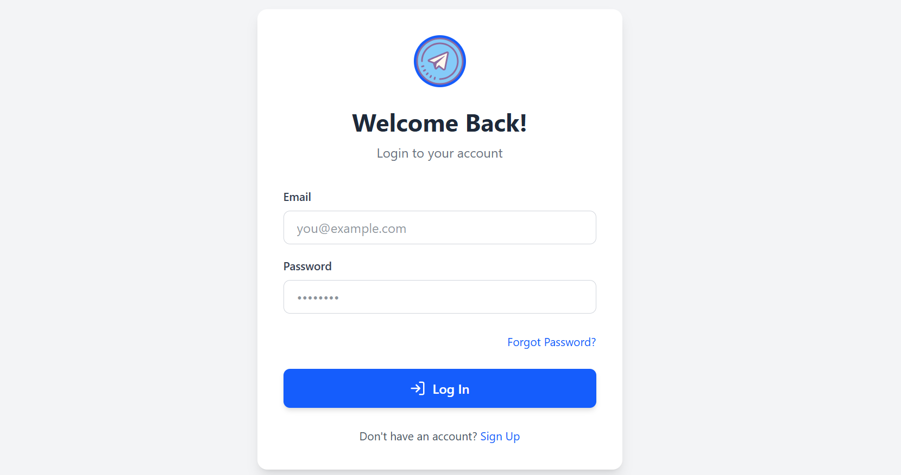
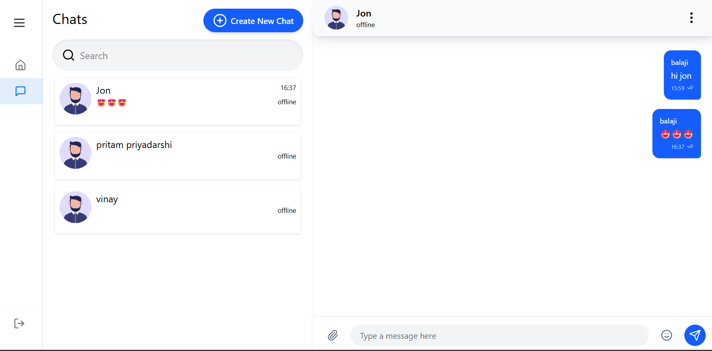

# Chat App

A real-time chat application supporting private and group messaging, built with the MERN stack and Socket.IO.

---

## 🚀 Tech Stack

- **Frontend:** React.js, Vite, Redux Toolkit, RTK Query, Tailwind CSS, Socket.IO Client, Emoji Mart
- **Backend:** Node.js, Express.js, MongoDB, Mongoose, Socket.IO, JWT, bcrypt
- **Other:** Postman (API testing), Visual Studio Code, Git

---

## 🛠️ Installation

### Prerequisites

- Node.js (v16+ recommended)
- npm or yarn
- MongoDB (local or cloud)

### 1. Clone the repository

```bash
git clone https://github.com/VinayChavan2006/Elevate-Labs.git
cd chat-app
```

### 2. Install dependencies

#### Backend

```bash
cd backend
npm install
```

#### Frontend

```bash
cd ../frontend
npm install
```

### 3. Set up environment variables

- Create a `.env` file in both `backend` and `frontend` folders.
- Example for `frontend/.env`:
  ```
  VITE_BACKEND_URI=http://localhost:8000
  ```
- Example for `backend/.env`:
  ```
  MONGO_URI=your_mongodb_connection_string
  JWT_SECRET=your_jwt_secret
  PORT=8000
  FRONTEND_URI=http://localhost:5173
  ```

### 4. Start the servers

#### Backend

```bash
cd backend
npm run dev
```

#### Frontend

```bash
cd ../frontend
npm run dev
```

- Frontend will run on [http://localhost:5173](http://localhost:5173)
- Backend will run on [http://localhost:8000](http://localhost:8000)

---

## 📸 Project Demo

### Screenshots

<!-- Replace with your own images -->



### Demo Video

<!-- Replace with your own video link or embed -->
[](./demo/chat-website-demo.mp4)

---


**Feel free to contribute