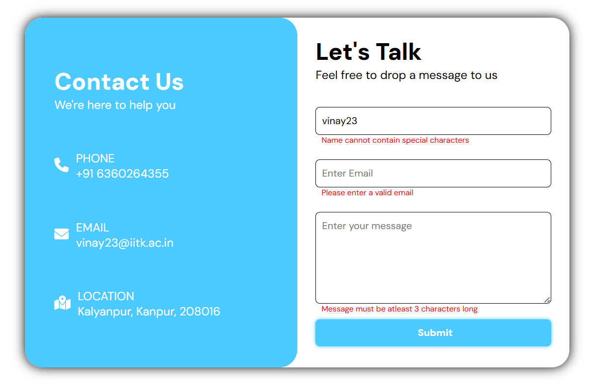

# Contact Us Form

A modern "Contact Us" form built with HTML, CSS, and JavaScript including validations for input fields.

---

## Features

- **Client-side Validation:** Checks for valid name, email, and message on submission.
- **Error Messages:** User-friendly error messages for invalid input.
- **Google Fonts:** Uses Google Fonts and Font Awesome icons.

---

## Technologies Used

- HTML5
- CSS3
- JavaScript (for validation)
- [Font Awesome](https://fontawesome.com/) (for icons)
- [Google Fonts - DM Sans](https://fonts.google.com/specimen/DM+Sans)

---

## How to Use

1. **Clone or Download the Repository**
2. Open `index.html` in your browser.
3. Fill in the form fields and submit.
4. If there are errors, they will be shown below each field.
5. On successful validation, a success alert will appear and the form will reset.

---

## Validation Rules

- **Name:**  
  - At least 3 characters  
  - Only letters and spaces  
  - Maximum 100 characters

- **Email:**  
  - Must be a valid email format

- **Message:**  
  - At least 3 characters  
  - Maximum 500 characters

---

## Project Structure

```
├── index.html
├── styles.css
└── script.js
```

---

## Screenshots



---

