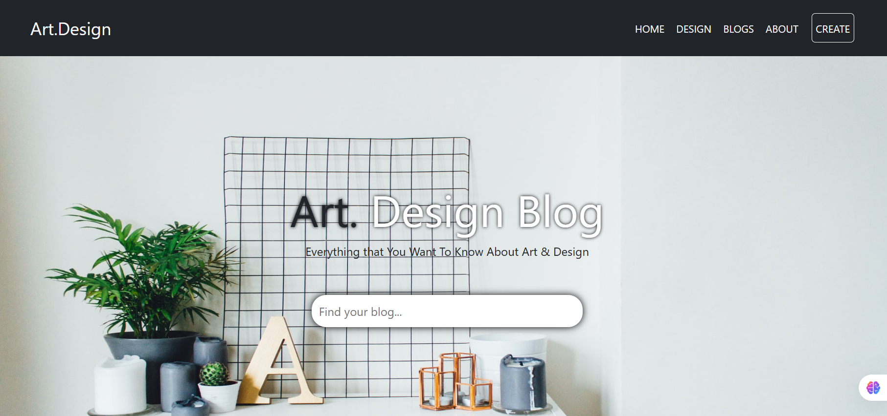

# Art.Design Blog

A visually engaging blog landing page for art and design enthusiasts. Built with HTML, CSS, and Bootstrap 5.

## Features

- Responsive navigation bar with branding
- Hero section with banner image and search bar
- Blog posts displayed as Bootstrap cards with images
- Social media icons in the footer
- Clean, modern design

## Project Structure

```
index.html
style.css
assets/
  art-design-1.jpg
  art-design-2.jpg
  art-design-3.jpg
  art-design-4.jpg
  art-design-5.jpg
  art-design-6.jpg
  banner-bg.jpg
```

## Getting Started

1. **Clone or Download** this repository.
2. Make sure all files and the `assets` folder are in the same directory.
3. Open `index.html` in your browser.

## Screenshots



## Dependencies

- [Bootstrap 5](https://getbootstrap.com/)
- [Font Awesome 6](https://fontawesome.com/)

## Customization

- Add or replace images in the `assets/` folder.
- Edit `index.html` to update blog post content.
- Modify `style.css` for further styling.

---

**Art.Design Blog Page**  
Everything that You Want To Know About Art & Design
